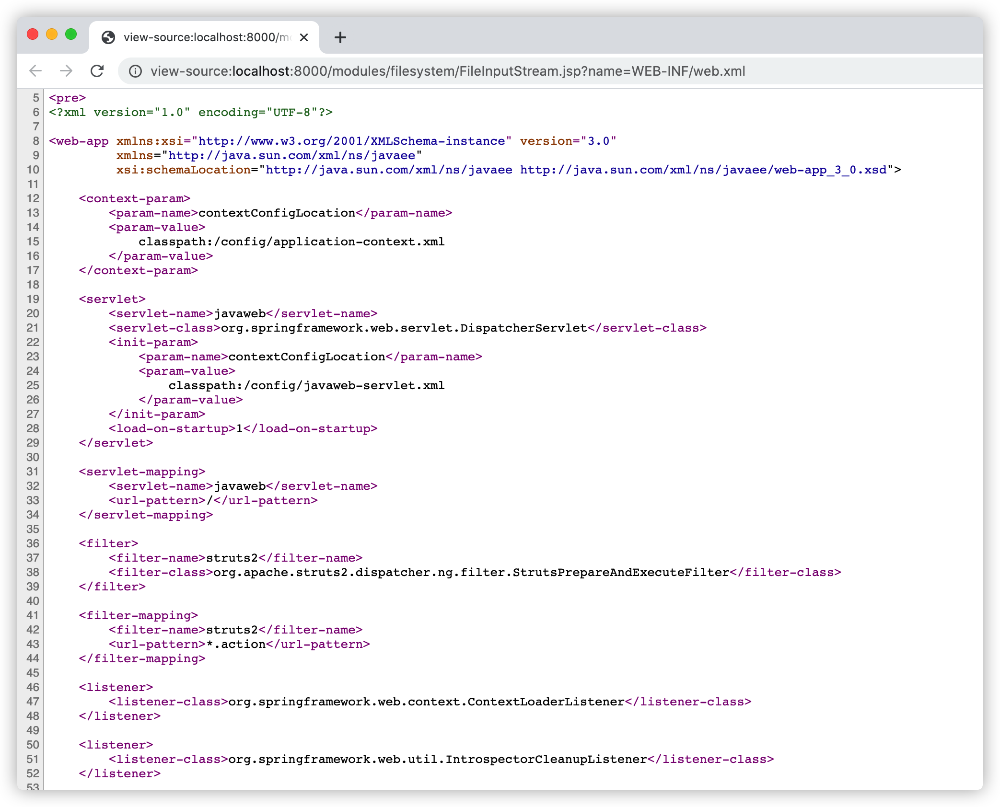
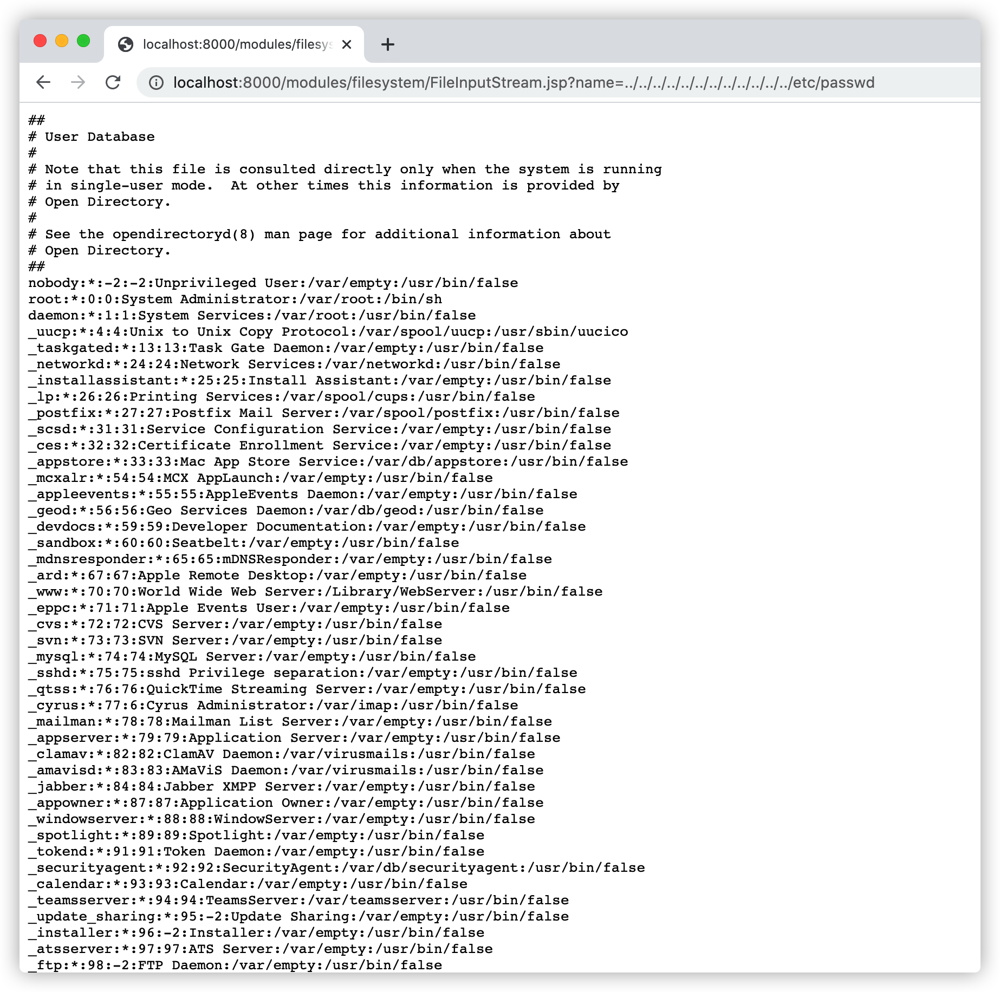

# 恶意文件访问类漏洞

## 1. 读文件

示例-存在恶意文件读取漏洞代码：

```jsp
<%@ page contentType="text/html;charset=UTF-8" language="java" %>
<%@ page import="java.io.File" %>
<%@ page import="java.io.FileInputStream" %>

<pre>
<%
    File file = new File(request.getRealPath("/") + request.getParameter("name"));
    FileInputStream in = new FileInputStream(file);
    int tempbyte;

    while ((tempbyte = in.read()) != -1) {
        out.write(tempbyte);
    }

    in.close();
%>
</pre>
```


### 1.1 同级目录任意文件读取漏洞测试

攻击者通过传入恶意的`name`参数可以读取服务器中的任意文件:http://localhost:8000/modules/filesystem/FileInputStream.jsp?name=./index.jsp，如下图：


### 1.2 读取WEB-INF/web.xml测试

当攻击者通过传入恶意的`name`参数值为`WEB-INF/web.xml`时可以读取Web应用的配置信息，请求：http://localhost:8000/modules/filesystem/FileInputStream.jsp?name=WEB-INF/web.xml，如下图：




### 1.3 跨目录读取敏感文件测试

开发人员通常使用文件名、文件后缀、文件目录进行拼接的方式来获取待操作文件的绝对路径并进行相关操作，在这种情况下，攻击者如果想要查看服务器中的其他目录，则会使用 `../` 进行目录的跨越，常使用的操作是跨越目录到服务根目录，再向下寻找文件。例如`../../../../../../../../etc/passwd`。

请求：http://localhost:8000/modules/filesystem/FileInputStream.jsp?name=../../../../../../../../../../../../etc/passwd，如下图：




## 2. 写文件

示例-存在恶意文件写入漏洞的代码：

```jsp
<%@ page contentType="text/html;charset=UTF-8" language="java" %>
<%@ page import="java.io.File" %>
<%@ page import="java.io.FileOutputStream" %>

<%
    File file = new File(request.getParameter("f"));
    FileOutputStream fos = new FileOutputStream(file);
    fos.write(request.getParameter("c").getBytes());
    fos.flush();
    fos.close();

    out.println(file.getAbsoluteFile() + "\t" + file.exists());
%>
```


### 2.1 跨目录写入文件测试

攻击者可能期望跨目录写入文件，如写入 SSH KEY、写入计划任务等等方式进行进一步的攻击。

请求：http://localhost:8000/modules/filesystem/file-w.jsp?f=../../a.rar&c=aaa，如下图：


### 2.2 绝对路径写入文件测试

攻击者通过传入恶意的参数`f`和`c`参数可以使用绝对路径在服务器上写入恶意的`WebShell`后门或其他文件，请求：http://localhost:8000/modules/filesystem/file-w.jsp?f=/tmp/2.txt&c=webshell，如下图：


## 3. 删除文件

### 3.1 任意文件删除测试

示例-存在任意文件删除漏洞代码：

```jsp
<%@ page contentType="text/html;charset=UTF-8" language="java" %>
<%@ page import="java.io.File" %>
<%
    File file = new File(request.getParameter("file"));
    out.println(file.delete());
%>
```

攻击者通过参入`file`参数即可删除服务器中的任意文件：


### 3.2 FileSystem任意文件删除测试

示例-存在任意文件删除漏洞代码：

```jsp
<%@ page contentType="text/html;charset=UTF-8" language="java" %>
<%@ page import="java.io.File" %>
<%@ page import="java.lang.reflect.Method" %>

<%
    String file = request.getParameter("file");

    Method m = Class.forName("java.io.DefaultFileSystem").getMethod("getFileSystem");
    m.setAccessible(true);
    Object fs = m.invoke(null);

    Method m2 = fs.getClass().getMethod("delete", File.class);
    m2.setAccessible(true);
    out.print(m2.invoke(fs, new File(file)));
%>
```

攻击者通过参入`file`参数即可删除服务器中的任意文件：


攻击者通过反射调用 Filesystem 并执行` delete`方法，用来绕过对 File 对象 `delete`方法的防御。


## 4. 文件/目录复制、移动

示例-存在任意文件复制漏洞代码：

```jsp
<%@ page contentType="text/html;charset=UTF-8" language="java" %>
<%@ page import="java.io.IOException" %>
<%@ page import="java.nio.file.Files" %>
<%@ page import="java.nio.file.Path" %>
<%@ page import="java.nio.file.Paths" %>
<pre>
<%
    try {
        Path path = Files.copy(Paths.get(request.getParameter("source")), Paths.get(request.getParameter("dest")));

        out.println(path);
    } catch (IOException e) {
        e.printStackTrace();
    }
%>
</pre>
```

攻击者传入恶意的`source`和`dest`参数可以实现复制任何文件到任意的目录，比如攻击者可以在用户中心上传一张内容为`WebShell`恶意代码的`1.jpg`图片文件，然后通过漏洞将`1.jpg`图片文件，复制到同级目录并更新名称为`1.jsp`的可解析脚本文件，访问`1.jsp`文件即可实现控制服务器的目的，如下图：


在实际环境中，应用系统可能根据需求在配置文件如`web.xml`中或代码层面如`filter`设置某些目录（如上传目录、资源目录等）禁止对 `.jsp` 脚本文件等可执行文件进行解析，因此，攻击者需要将恶意文件移动或复制到其他能够执行的目录进行解析。请求：http://localhost:8000/modules/filesystem/files-copy.jsp?source=/tmp/1.jsp&dest=/Users/yz/Desktop/apache-tomcat-8.5.31/webapps/ROOT/1.jsp，如下图：


## 5. 重命名文件

示例-存在文件名重命名漏洞代码：

```jsp
<%@ page contentType="text/html;charset=UTF-8" language="java" %>
<%@ page import="java.io.File" %>
<%
    String fileName1 = request.getParameter("s");
    String fileName2 = request.getParameter("d");

    File f = new File(fileName1);
    File d = new File(fileName2);

    f.renameTo(d);

    out.println(d + "\t" + d.exists());
%>
```

攻击者传入恶意的`s`和`d`参数即可将文件名为`1.txt`的文本文件重命名为`1.jsp`可执行脚本文件，请求：http://localhost:8000/modules/filesystem/file-rename.jsp?s=/tmp/1.txt&d=/tmp/1.jsp，如下图：


攻击者会使用重命名的方式将（txt、jpg等资源文件）重命名为可执行脚本文件（jsp）来获得`webshell`从而控制Web应用系统，并绕过某些安全防护机制。常见的攻击手段是在文件上传时，上传包含恶意代码的图片文件，再利用重命名将其转为可执行的脚本文件。


## 6. 文件目录遍历

示例-存在任意目录遍历代码：

```jsp
<%@ page contentType="text/html;charset=UTF-8" language="java" %>
<%@ page import="java.io.File" %>

<pre>
<%
    String[] files = new File(request.getParameter("dir")).list();

    for (String file : files) {
        out.println(file);
    }
%>
</pre>
```


### 6.1 相对目录遍历测试

攻击者传入`dir`参数即可遍历出对应目录的所有文件，http://localhost:8000/modules/filesystem/file-list.jsp?dir=../，如下图：


由于攻击者传入的`dir`参数值为相对路径，可能是多级目录名称，也可能只是一个非常简单的`../`上级目录，大部分的`WAF`并不能精准识别这类攻击。


### 6.2 绝对目录遍历测试

当攻击者可以传入绝对路径进行攻击时，路径中将不会存在`../`等穿越目录特征，很多WAF将无法攻击阻拦，请求：http://localhost:8000/modules/filesystem/file-list.jsp?dir=/etc，如下图：


## 7. IO和NIO.2的文件系统支持

### 7.1 使用NIO任意文件读取漏洞测试

示例-存在任意文件读取的NIO.2代码：

```jsp
<%@ page contentType="text/html;charset=UTF-8" language="java" %>
<%@ page import="java.io.IOException" %>
<%@ page import="java.nio.file.Files" %>
<%@ page import="java.nio.file.Paths" %>
<pre>
<%
    try {
        byte[] bytes = Files.readAllBytes(Paths.get(request.getParameter("file")));
        out.println(new String(bytes));
    } catch (IOException e) {
        e.printStackTrace();
    }
%>
</pre>
```

攻击者传入恶意的`file`即可读取服务器中的任意文件：


