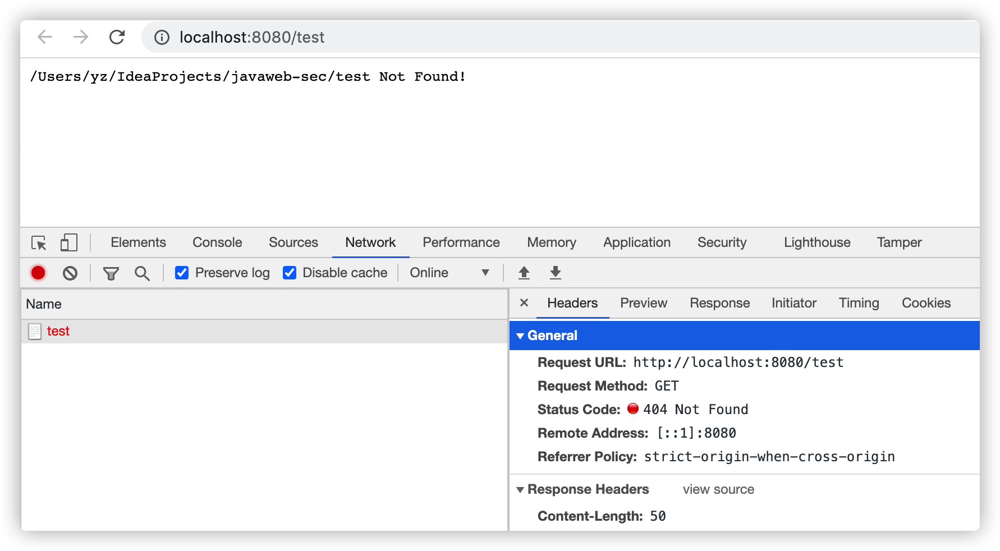
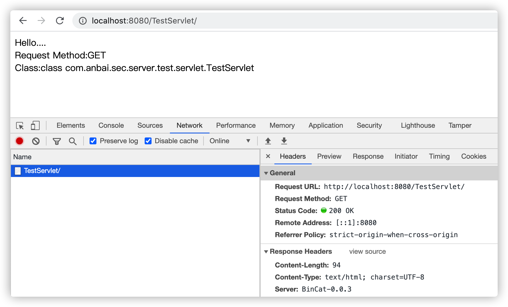

# BinCat

大家好，我是`BinCat`，一个基于`JavaEE API`实现的超简单(不安全的非标准的​​，仅用于学习Java容器原理)的`Web Server`。


## Http请求协议解析

Http协议(`超文本传输协议，HyperText Transfer Protocol`)是一种用于分布式、协作式和超媒体信息系统的应用层协议。HTTP是万维网的数据通信的基础。要想能够处理Http请求就必须先解析Http请求，不同的Http请求方式对应的数据包也是不一样的。

**GET请求包示例：**

```
GET / HTTP/1.1
Host: localhost:8080
User-Agent: curl/7.64.1
Accept: */*

```

**POST请求包示例：**

```
POST /?s=java HTTP/1.1
Host: localhost:8080
User-Agent: curl/7.64.1
Accept: */*
Cookie: Hm_lvt_f4c571d9b8811113b4f18e87a6dbe619=1597582351; Hm_lpvt_f4c571d9b889b22224f18e87a6dbe619=1599562693; JSESSIONID=LgxJ127kT7ymIGbC2T1TeipnMP9_2_CqJQjmrqOb
Content-Length: 17
Content-Type: application/x-www-form-urlencoded

id=123&name=admin
```

### 解析Http简要流程

解析POST请求的简单流程如下(`非multipart或chunked请求`)：

1. 解析第一行的Http协议信息。
2. 解析Http请求Header信息。
3. 解析请求主体(Body)部分。

### 解析Http请求协议信息

接下来我们将以上述的POST包解析为例简单的实现Http协议解析。如上POST包，第一行数据中包含了请求方式、请求的URL地址以及Http协议版本信息(空格隔开)：`POST /?s=java HTTP/1.1`。那么我们只需要使用空白符号将字符串切割成数组即可完成解析。

**解析Http请求协议示例代码片段：**

```java
// 从Socket中读取一行数据，读取请求的URL
String str = dis.readLine();

// 切割请求Http协议信息
String[] strs = str.split("\\s+");

// 解析Http请求方法类型
String method = strs[0];

// 解析Http请求URL地址
String url = strs[1];

// 解析Http请求版本信息
String httpVersion = strs[2];
```

### 解析Http请求Header信息

解析完Http请求协议后就应该继续解析Http Header信息了，Http请求头从第二行开始到一个空白行结束，Header中的键值对以`: `分割，如下：

```
Host: localhost:8080
User-Agent: curl/7.64.1
Accept: */*
Content-Length: 17
Content-Type: application/x-www-form-urlencoded
```

**解析Http头示例代码片段：**

```java
// 创建Header对象
Map<String, String> header = new ConcurrentHashMap<String, String>();

// 解析请求头信息
while (true) {
    // 按行读取Header头信息
    String line = dis.readLine();

    // 当读取到空行时停止解析Header
    if ("".equals(line)) {
      	break;
    }

    // 切割Header的Key/Value
    String[] headers = line.split(":\\s*", -1);

    header.put(headers[0], headers[1]);
}
```

解析完Header后剩下的也就是最后的Http请求主体部分了，浏览器会将请求的参数以`&`为连接符拼接出多个参数，参数名称和参数值以`=`分割，并且参数值默认会使用URL编码，如下:

```
id=123&name=admin
```

解析body中的请求参数时需要先从Header中读取请求的主体大小，即:`Content-Length`，因为body中允许出现换行`\n`等特殊内容，所以解析body时应该按字节读取数据。除此之外，解析Body中的请求参数之前应该先解析URL中的请求参数，即GET传参部分：`/?s=java`，然后再解析body中的参数。

**解析Http GET参数代码片段：**

```java
// 初始化请求参数数组
Map<String, String> parameterMap = new ConcurrentHashMap<String, String>();

// 解析GET请求参数
if (url.contains("?")) {
    String parameterStr = url.split("\\?")[1];

    // 按"&"切割GET请求的参数
    String[] parameters = parameterStr.split("&");

    // 解析GET请求参数
    for (String parameter : parameters) {
        String[] tmp = parameter.split("=", -1);

        if (tmp.length == 2) {
						parameterMap.put(tmp[0], new String[]{URLDecoder.decode(tmp[1])});
				}
    }
}
```

**Cookie解析**

Cookie是非常Http请求中非常重要的用户凭证，Cookie位于请求头中的`cookie`字段，多个`Cookie`以`; `分割，`Cookie`的参数和参数值以`=`切分。`Cookie`中会存储一个叫`JSESSIONID`(Java标准容器中叫`JSESSIONID`)，用于识别服务器端存储的用户会话信息。

**示例Cookie：**

```
Cookie: Hm_lvt_f4c571d9b8811113b4f18e87a6dbe619=1597582351; Hm_lpvt_f4c571d9b889b22224f18e87a6dbe619=1599562693; JSESSIONID=LgxJ127kT7ymIGbC2T1TeipnMP9_2_CqJQjmrqOb
```

**示例Cookie解析代码片段：**

```java
// 解析Cookie
if (headerMap.containsKey("cookie")) {
    // 切分Cookie字符串
    String[] cookies = headerMap.get("cookie").split(";\\s+", -1);

    // 初始化Cookie数组长度
    this.cookie = new Cookie[cookies.length];

    for (int i = 0; i < cookies.length; i++) {
        String   cookieStr = cookies[i];
        String[] tmp       = cookieStr.split("=", -1);

        if (tmp.length == 2) {
            // 创建Cookie对象
            this.cookie[i] = new Cookie(tmp[0], URLDecoder.decode(tmp[1]));
				}
    }
}
```


### 解析Http请求主体

**解析Http主体代码片段：**

```java
if ("POST".equalsIgnoreCase(method)) {
		String contentType = header.get("Content-Type");

		// 解析POST请求参数
		if ("application/x-www-form-urlencoded".equalsIgnoreCase(contentType)) {
			// 获取请求的主体长度
			int contentLength = Integer.parseInt(header.get("Content-Length"));

			// 创建一个和请求体一样大小的缓冲区
			byte[] bytes = new byte[contentLength];

			// 读取POST主体内容
			dis.read(bytes);

			// 解析POST请求内容
			String body = new String(bytes, "ISO8859-1");

			// 按"&"切割POST请求的参数
			String[] parameters = body.split("&");

			// 解析POST请求参数
			for (String parameter : parameters) {
          String[] tmp = parameter.split("=", -1);

          if (tmp.length == 2) {
            	parameterMap.put(tmp[0], new String[]{URLDecoder.decode(tmp[1], "UTF-8")});
          }
			}
	}
}
```


## BinCat v1-简单的请求文件访问处理

实现一个简单的Web服务器非常容易，使用`ServerSocket`在服务器端监听端口并等待浏览器请求，一旦接收到浏览器数据后就开始解析Http协议，最后将服务器端请求处理完后通过`Socket`返回给浏览器即可。


V1版本，我们先实现一个简单的读取服务器静态文件的功能，在后续版逐渐完善。

**BinCat v1示例:**

```java
package com.anbai.sec.server;

import java.io.*;
import java.net.ServerSocket;
import java.net.Socket;
import java.util.logging.Logger;

/**
 * ServerSocket示例
 */
public class BinCatServerV1 {

	private static final Logger LOG = Logger.getLogger("info");

	public static void main(String[] args) {
		try {
			// 设置服务监听端口
			int port = 8080;

			// 设置服务名称
			String serverName = "BinCat-0.0.1";

			// 创建ServerSocket，监听本地端口
			ServerSocket ss = new ServerSocket(port);

			LOG.info(serverName + "启动成功，监听端口:" + port);

			while (true) {
				// 等待客户端连接
				Socket socket = ss.accept();

				try {
					// 获取Socket输入流对象
					InputStream in = socket.getInputStream();

					// 获取Socket输出流对象
					OutputStream out = socket.getOutputStream();

					// 创建输出流对象
					BufferedReader br = new BufferedReader(new InputStreamReader(in));

					// 从Socket中读取一行数据
					String str = br.readLine();

					if (str == null) {
						continue;
					}

					// 切割请求Http协议信息
					String[] strs = str.split("\\s+");

					// 解析Http请求URL地址
					String url = strs[1];

					// 输出服务器返回信息
					String msg = "";

					// 当前服务器运行目录下的文件
					File file = new File(System.getProperty("user.dir"), url);

					if (file.exists()) {
						out.write("HTTP/1.1 200 OK\n".getBytes());
						msg = file.getAbsolutePath();
					} else {
						out.write("HTTP/1.1 404 Not Found\n".getBytes());
						msg = file.getAbsolutePath() + " Not Found!";
					}

					// 输出返回字节数
					out.write(("Content-Length: " + msg.getBytes().length + "\n").getBytes());

					// 写入换行
					out.write("\n".getBytes());

					// 将读取到的数据写入到客户端Socket
					out.write(msg.getBytes());

					in.close();
					out.close();
				} catch (IOException e) {
					LOG.info("处理客户端请求异常:" + e);
				} finally {
					socket.close();
				}
			}
		} catch (IOException e) {
			e.printStackTrace();
		}
	}

}
```

启动`BinCat`服务后控制台将输出:

```
九月 09, 2020 5:18:50 下午 com.anbai.sec.server.BinCatServerV1 main
信息: BinCat-0.0.1启动成功，监听端口:8080
```

浏览器请求[localhost:8080](http://localhost:8080)即可在浏览器中输出当前请求的文件是否存在:


请求一个不存在的文件地址，浏览器将会输出错误信息，如请求[localhost:8080/test](http://localhost:8080/test)：



从上图中我们可以看到响应的状态码和body都能够正确的被浏览器解析。


## BinCat v2-简单解析请求参数

V2版本我们需要支持请求参数解析以及简单的HTML页面渲染功能。

**BinCat v2示例:**

```java
package com.anbai.sec.server;

import java.io.*;
import java.net.ServerSocket;
import java.net.Socket;
import java.net.URLDecoder;
import java.util.Map;
import java.util.concurrent.ConcurrentHashMap;
import java.util.logging.Logger;

/**
 * ServerSocket Http 服务器示例
 */
public class BinCatServerV2 {

	private static final Logger LOG = Logger.getLogger("info");

	public static void main(String[] args) {
		try {
			// 设置服务监听端口
			int port = 8080;

			// 设置服务名称
			String serverName = "BinCat-0.0.2";

			// 创建ServerSocket，监听本地端口
			ServerSocket ss = new ServerSocket(port);

			LOG.info(serverName + "启动成功，监听端口:" + port);

			while (true) {
				// 等待客户端连接
				Socket socket = ss.accept();

				try {
					// 获取Socket输入流对象
					InputStream in = socket.getInputStream();

					// 获取Socket输出流对象
					OutputStream out = socket.getOutputStream();

					// 创建数据输出流对象
					DataInputStream dis = new DataInputStream(in);

					// 从Socket中读取一行数据，读取请求的URL
					String str = dis.readLine();

					if (str == null) {
						socket.close();
						continue;
					}

					// 切割请求Http协议信息
					String[] strs = str.split("\\s+");

					// 解析Http请求方法类型
					String method = strs[0];

					// 解析Http请求URL地址
					String url = strs[1];

					// 初始化Http请求URL地址
					String requestURL = url;

					// 初始化Http请求的QueryString
					String queryString;

					// 解析Http请求版本信息
					String httpVersion = strs[2];

					// 创建Header对象
					Map<String, String> header = new ConcurrentHashMap<String, String>();

					// 初始化请求参数数组
					Map<String, String> parameterMap = new ConcurrentHashMap<String, String>();

					// 解析GET请求参数
					if (url.contains("?")) {
						String[] parameterStrs = url.split("\\?");
						requestURL = parameterStrs[0];
						queryString = parameterStrs[1];

						// 按"&"切割GET请求的参数
						String[] parameters = queryString.split("&");

						// 解析GET请求参数
						for (String parameter : parameters) {
							String[] tmp = parameter.split("=", -1);

							if (tmp.length == 2) {
								parameterMap.put(tmp[0], URLDecoder.decode(tmp[1]));
							}
						}
					}

					// 解析请求头信息
					while (true) {
						// 按行读取Header头信息
						String line = dis.readLine();

						// 当读取到空行时停止解析Header
						if ("".equals(line)) {
							break;
						}

						// 切割Header的Key/Value
						String[] headers = line.split(":\\s*", -1);

						header.put(headers[0], headers[1]);
					}

					// 输出服务器返回信息
					StringBuffer msg = new StringBuffer();

					// 处理Http请求,当浏览器请求主页时返回服务器信息
					if ("/".equals(requestURL)) {
						out.write("HTTP/1.1 200 OK\n".getBytes());

						// 根据Http请求类型处理不同的请求
						if ("GET".equalsIgnoreCase(method)) {
							// 输出服务器处理结果
							msg.append("<html>\n" +
									"<head>\n" +
									"    <title>Login Test</title>\n" +
									"</head>\n" +
									"<body>\n" +
									"<div style=\"margin: 30px;\">\n" +
									"    <form action=\"/\" method=\"POST\">\n" +
									"        Username:<input type=\"text\" name=\"username\" value=\"admin\"/><br/>\n" +
									"        Password:<input type=\"text\" name=\"password\" value=\"'=0#\"/><br/>\n" +
									"        <input type=\"submit\" value=\"Login\"/>\n" +
									"    </form>\n" +
									"</div>\n" +
									"</body>\n" +
									"</html>");
						} else if ("POST".equalsIgnoreCase(method)) {
							String contentType = header.get("Content-Type");

							// 解析POST请求参数
							if ("application/x-www-form-urlencoded".equalsIgnoreCase(contentType)) {
								// 获取请求的主体长度
								int contentLength = Integer.parseInt(header.get("Content-Length"));

								// 创建一个和请求体一样大小的缓冲区
								byte[] bytes = new byte[contentLength];

								// 读取POST主体内容
								dis.read(bytes);

								// 解析POST请求内容
								String body = new String(bytes, "ISO8859-1");

								// 按"&"切割POST请求的参数
								String[] parameters = body.split("&");

								// 解析POST请求参数
								for (String parameter : parameters) {
									String[] tmp = parameter.split("=", -1);

									if (tmp.length == 2) {
										parameterMap.put(tmp[0], URLDecoder.decode(tmp[1]));
									}
								}

								// 定义SQL语句
								String sql = "select id,username,password from sys_user where username = '" +
										parameterMap.get("username") + "' and password = '" +
										parameterMap.get("password") + "'";

								msg.append("<font color='red'>JDBC 查询SQL:" + sql + "</font>\n");
								msg.append("<h3>请求头:</h3>\n");
								msg.append("<pre>\n");

								for (String key : header.keySet()) {
									msg.append(key + ": " + header.get(key) + "\n");
								}

								msg.append("<pre>\n");
								msg.append("<h3>请求参数:</h3>\n");

								// 循环遍历请求参数
								for (String key : parameterMap.keySet()) {
									msg.append(key + ": " + parameterMap.get(key) + "\n");
								}
							}
						}
					} else {
						out.write("HTTP/1.1 404 Not Found\n".getBytes());

						// 输出错误信息
						msg.append("404");
					}

					// 输出Web服务器信息
					out.write(("Server: " + serverName + "\n").getBytes());

					// 输出返回的消息类型
					out.write(("Content-Type: text/html; charset=UTF-8\n").getBytes());

					// 请求响应内容
					byte[] responseByte = msg.toString().getBytes();

					// 输出返回字节数
					out.write(("Content-Length: " + responseByte.length + "\n").getBytes());

					// 写入换行
					out.write("\n".getBytes());

					// 将读取到的数据写入到客户端Socket
					out.write(responseByte);

					in.close();
					out.close();
				} catch (IOException e) {
					LOG.info("处理客户端请求异常:" + e);
				} finally {
					socket.close();
				}
			}
		} catch (IOException e) {
			e.printStackTrace();
		}
	}

}
```

访问Web服务测试:


提交登陆表单测试：


## BinCat V3-实现Servlet3.x API

`V1`和`V2`我们完成了一个简单的文件访问服务和请求参数解析服务，`V3`我们继续添加`Servlet API`，从而理解`Servlet`的工作原理。

添加`Servlet3.x`依赖：

```xml
<dependency>
    <groupId>javax.servlet</groupId>
    <artifactId>javax.servlet-api</artifactId>
    <version>3.0.1</version>
</dependency>
```

创建`com.anbai.sec.server.servlet.BinCatRequest`类并继承`javax.servlet.http.HttpServletRequest`，然后需要实现`HttpServletRequest`接口方法，作为一个非标准的`Servlet容器`我们自然是没必要严格的是实现里面的所有方法，选择几个方法实现一下就行了。

注意：示例以下中省去了解析协议`Servlet`接口的代码，完整代码请参考：`com.anbai.sec.server.servlet`包下的完整实现代码。

### HttpServletRequest实现

**BinCatRequest.java示例代码片段:**

```java
package com.anbai.sec.server.servlet;

import org.javaweb.utils.StringUtils;

import javax.servlet.*;
import javax.servlet.http.*;
import java.io.*;
import java.net.Socket;
import java.net.URLDecoder;
import java.security.Principal;
import java.util.*;
import java.util.concurrent.ConcurrentHashMap;
import java.util.logging.Logger;

/**
 * BinCat 请求解析实现对象，解析Http请求协议和参数
 */
public class BinCatRequest implements HttpServletRequest {

	// 客户端Socket连接对象
	private final Socket clientSocket;

	// Socket输入流对象
	private final InputStream socketInputStream;

	// Http请求头对象
	private Map<String, String> headerMap;

	// Http请求参数对象
	private Map<String, String[]> parameterMap;

	// Http请求attribute对象
	private final Map<String, Object> attributeMap = new ConcurrentHashMap<String, Object>();

	// Http请求Cookie对象
	private Cookie[] cookie;

	// Http请求Cookie对象
	private final Map<String, String> cookieMap = new ConcurrentHashMap<String, String>();

	// Http请求Session对象
	private final Map<String, BinCatSession> sessionMap = new ConcurrentHashMap<String, BinCatSession>();

	// Http请求方法类型
	private String requestMethod;

	// Http请求URL
	private String requestURL;

	// Http请求QueryString
	private String queryString;

	// Http请求协议版本信息
	private String httpVersion;

	// 是否已经解析过Http请求参数，防止多次解析请求参数
	private volatile boolean parsedParameter = false;

	// Http请求内容长度
	private int contentLength;

	// Http请求内容类型
	private String contentType;

	// 存储Session的ID名称
	private static final String SESSION_ID_NAME = "JSESSIONID";

	// Http请求主机名
	private String host;

	// Http请求主机端口
	private int port;

	private static final Logger LOG = Logger.getLogger("info");

	public BinCatRequest(Socket clientSocket) throws IOException {
		this.clientSocket = clientSocket;
		this.socketInputStream = clientSocket.getInputStream();

		// 解析Http协议
		parse();
	}

	/**
	 * 解析Http请求协议，不解析Body部分
	 *
	 * @throws IOException
	 */
	private void parse() throws IOException {
		// 此处省略Http请求协议解析、参数解析等内容...
	}

	/**
	 * 解析Http请求参数
	 *
	 * @throws IOException Http协议解析异常
	 */
	private synchronized void parseParameter() {
		// 此处省略Http请求协议解析、参数解析等内容...
	}

  // 此处省略HttpServletRequest接口中的大部分方法，仅保留几个示例方法...

	public String getHeader(String name) {
		return this.headerMap.get(name);
	}

	public ServletInputStream getInputStream() throws IOException {
		return new ServletInputStream() {
			@Override
			public int read() throws IOException {
				return socketInputStream.read();
			}
		};
	}

	public String getParameter(String name) {
		if (!parsedParameter) {
			this.parseParameter();
		}

		if (parameterMap.containsKey(name)) {
			return this.parameterMap.get(name)[0];
		}

		return null;
	}
  
	public String getRemoteAddr() {
		return clientSocket.getInetAddress().getHostAddress();
	}

	public void setAttribute(String name, Object o) {
		attributeMap.put(name, o);
	}

}
```

### HttpServletResponse实现

**BinCatResponse.java示例代码片段:**

```java
package com.anbai.sec.server.servlet;

import javax.servlet.ServletOutputStream;
import javax.servlet.http.Cookie;
import javax.servlet.http.HttpServletResponse;
import java.io.ByteArrayOutputStream;
import java.io.IOException;
import java.io.PrintWriter;
import java.net.Socket;
import java.net.URLEncoder;
import java.util.*;

public class BinCatResponse implements HttpServletResponse {

	private final Socket socket;

	private final Map<String, String> header;

	private final ByteArrayOutputStream out;

	private int status = 404;

	private String statusMessage = "Not Found";

	private String charset = "UTF-8";

	private int contentLength = 0;

	private String contentType = "text/html; charset=UTF-8";

	private String location;

	public BinCatResponse(Socket socket, Map<String, String> header, ByteArrayOutputStream out) {
		this.socket = socket;
		this.header = header;
		this.out = out;
	}

  // 此处省略HttpServletResponse接口中的大部分方法，仅保留几个示例方法...
  
	public void setHeader(String name, String value) {
		this.header.put(name, value);
	}
  
	public String getHeader(String name) {
		return header.get(name);
	}

	public PrintWriter getWriter() throws IOException {
		return new PrintWriter(out);
	}

}
```

### HttpSession实现

**BinCatSession.java示例代码片段:**

```java
package com.anbai.sec.server.servlet;

import javax.servlet.ServletContext;
import javax.servlet.http.HttpSession;
import javax.servlet.http.HttpSessionContext;
import java.util.Enumeration;
import java.util.Map;
import java.util.concurrent.ConcurrentHashMap;

/**
 * BinCat Session实现
 */
public class BinCatSession implements HttpSession {

	private final String sessionID;

	// Http请求Session对象
	private final Map<String, Object> sessionMap = new ConcurrentHashMap<String, Object>();

	public BinCatSession(String sessionID) {
		this.sessionID = sessionID;
	}

  // 此处省略HttpSession接口中的大部分方法，仅保留几个示例方法...
  
	public Object getAttribute(String name) {
		return this.sessionMap.get(name);
	}

	public void setAttribute(String name, Object value) {
		this.sessionMap.put(name, value);
	}

}
```

### Servlet类注册

`Servlet3.0`支持`web.xml`和注解两种方式配置，但不管是通过那种方式都需要知道`Servlet`的处理类和映射的`URL`地址，这里为了方法理解我将解析`web.xml`和扫描`@WebServlet`注解的步骤省略了，直接改成了手动配置一个Servlet映射类对象。

**注册Servlet类对象代码片段：**

```java
// 初始化Servlet映射类对象
final Set<Class<? extends HttpServlet>> servletList = new HashSet<Class<? extends HttpServlet>>();

// 手动注册Servlet类
servletList.add(TestServlet.class);
servletList.add(CMDServlet.class);
```

当接收到浏览器请求时候我们需要根据请求的URL地址来动态调用Servlet类相关的代码。

**调用Servlet类处理Http请求代码片段：**

```java
// 处理Http请求URL
for (Class<? extends HttpServlet> clazz : servletList) {
    WebServlet webServlet  = clazz.getAnnotation(WebServlet.class);
    String[]   urlPatterns = webServlet.urlPatterns();

    for (String urlPattern : urlPatterns) {
        try {
          // 检测请求的URL地址和Servlet的地址是否匹配
          if (Pattern.compile(urlPattern).matcher(uri).find()) {
              // 修改状态码
              response.setStatus(200, "OK");

              // 创建Servlet类实例
              HttpServlet httpServlet = clazz.newInstance();

              // 调用Servlet请求处理方法
              httpServlet.service(request, response);
              break;
          }
        } catch (IOException e) {
           // 修改状态码
				   response.setStatus(500, "Internal Server Error");
         	 e.printStackTrace();
        }
    }
}
```

### BinCat v3实现

`V3`简单的封装了`BinCatRequest`、`BinCatResponse`、`BinCatSession`，还是先了部分的`Servlet API`从而实现了一个最初级的`Servlet容器`。

**V3处理流程:**

1. 创建服务端Socket连接(`ServerSocket`)。
2. 手动注册`Servlet`类。
3. 创建用于处理请求的`BinCatRequest`对象。
4. `BinCatRequest`解析请求协议、请求头、请求参数、Cookie等。
5. 创建用于处理请求的`BinCatResponse`对象。
6. 解析`Servlet`类的`@WebServlet`注解，反射调用`Servlet`类方法处理Http请求。
7. 输出响应信息以及`Servlet`处理结果。
8. 关闭Socket连接。

**BinCat v3示例:**

```java
package com.anbai.sec.server;

import com.anbai.sec.server.servlet.BinCatRequest;
import com.anbai.sec.server.servlet.BinCatResponse;
import com.anbai.sec.server.test.servlet.CMDServlet;
import com.anbai.sec.server.test.servlet.TestServlet;
import org.javaweb.utils.StringUtils;

import javax.servlet.annotation.WebServlet;
import javax.servlet.http.HttpServlet;
import java.io.ByteArrayOutputStream;
import java.io.IOException;
import java.io.InputStream;
import java.io.OutputStream;
import java.net.ServerSocket;
import java.net.Socket;
import java.util.HashSet;
import java.util.Map;
import java.util.Set;
import java.util.concurrent.ConcurrentHashMap;
import java.util.logging.Logger;
import java.util.regex.Pattern;

/**
 * ServerSocket Http 服务器示例
 */
public class BinCatServerV3 {

	private static final Logger LOG = Logger.getLogger("info");

	public static void main(String[] args) {
		try {
			// 设置服务监听端口
			int port = 8080;

			// 设置服务名称
			String serverName = "BinCat-0.0.3";

			// 创建ServerSocket，监听本地端口
			ServerSocket ss = new ServerSocket(port);

			// 初始化Servlet映射类对象
			final Set<Class<? extends HttpServlet>> servletList = new HashSet<Class<? extends HttpServlet>>();

			// 手动注册Servlet类
			servletList.add(TestServlet.class);
			servletList.add(CMDServlet.class);

			LOG.info(serverName + "启动成功，监听端口:" + port);

			while (true) {
				// 等待客户端连接
				Socket socket = ss.accept();

				try {
					// 获取Socket输入流对象
					InputStream in = socket.getInputStream();

					// 获取Socket输出流对象
					OutputStream out = socket.getOutputStream();

					// 创建BinCat请求处理对象
					BinCatRequest request = new BinCatRequest(socket);

					// 创建BinCat请求处理结果输出流
					ByteArrayOutputStream baos = new ByteArrayOutputStream();

					// 创建BinCat请求处理结果Header对象
					Map<String, String> responseHeader = new ConcurrentHashMap<String, String>();

					// 创建BinCat响应处理对象
					BinCatResponse response = new BinCatResponse(socket, responseHeader, baos);

					// 请求URI地址
					String uri = request.getRequestURI();

					// 处理Http请求URL
					for (Class<? extends HttpServlet> clazz : servletList) {
						WebServlet webServlet  = clazz.getAnnotation(WebServlet.class);
						String[]   urlPatterns = webServlet.urlPatterns();

						for (String urlPattern : urlPatterns) {
							try {
								// 检测请求的URL地址和Servlet的地址是否匹配
								if (Pattern.compile(urlPattern).matcher(uri).find()) {
									// 修改状态码
									response.setStatus(200, "OK");

									// 创建Servlet类实例
									HttpServlet httpServlet = clazz.newInstance();

									// 调用Servlet请求处理方法
									httpServlet.service(request, response);
									break;
								}
							} catch (Exception e) {
								// 修改状态码
								response.setStatus(500, "Internal Server Error");
								e.printStackTrace();

								baos.write(("<pre>" + StringUtils.exceptionToString(e) + "</pre>").getBytes());
							}
						}
					}

					// 处理Http响应内容
					out.write(("HTTP/1.1 " + response.getStatus() + " " + response.getMessage() + "\n").getBytes());
					// 输出Web服务器信息
					out.write(("Server: " + serverName + "\n").getBytes());
					// 输出返回的消息类型
					out.write(("Content-Type: " + response.getContentType() + "\n").getBytes());
					// 输出返回字节数
					out.write(("Content-Length: " + baos.size() + "\n").getBytes());

					// 输出用户自定义的Header
					for (String key : responseHeader.keySet()) {
						out.write((key + ": " + responseHeader.get(key) + "\n").getBytes());
					}

					// 写入换行
					out.write("\n".getBytes());
					// 将读取到的数据写入到客户端Socket
					out.write(baos.toByteArray());

					in.close();
					out.close();
				} catch (Exception e) {
					LOG.info("处理客户端请求异常:" + e);
				} finally {
					socket.close();
				}
			}
		} catch (IOException e) {
			e.printStackTrace();
		}
	}

}
```

### Servlet功能测试

为了验证`BinCat`是否真的具备了`Servlet`处理能力，我们写两个测试用例：`TestServlet`和`CMDServlet`。

**TestServlet示例代码：**

```java
package com.anbai.sec.server.test.servlet;

import javax.servlet.annotation.WebServlet;
import javax.servlet.http.HttpServlet;
import javax.servlet.http.HttpServletRequest;
import javax.servlet.http.HttpServletResponse;
import java.io.IOException;
import java.io.OutputStream;

@WebServlet(name = "TestServlet", urlPatterns = "/TestServlet/")
public class TestServlet extends HttpServlet {

   @Override
   public void doGet(HttpServletRequest request, HttpServletResponse response) throws IOException {
      doPost(request, response);
   }

   @Override
   public void doPost(HttpServletRequest request, HttpServletResponse response) throws IOException {
      OutputStream out = response.getOutputStream();
      out.write(("Hello....<br/>Request Method:" + request.getMethod() + "<br/>Class:" + this.getClass()).getBytes());
   }

}
```

浏览器请求[http://localhost:8080/TestServlet/](http://localhost:8080/TestServlet/):



**CMDServlet示例代码：**

```java
package com.anbai.sec.server.test.servlet;

import org.javaweb.utils.IOUtils;

import javax.servlet.annotation.WebServlet;
import javax.servlet.http.HttpServlet;
import javax.servlet.http.HttpServletRequest;
import javax.servlet.http.HttpServletResponse;
import java.io.IOException;
import java.io.OutputStream;

@WebServlet(name = "CMDServlet", urlPatterns = "/CMD/")
public class CMDServlet extends HttpServlet {

   @Override
   public void doGet(HttpServletRequest request, HttpServletResponse response) throws IOException {
      doPost(request, response);
   }

   @Override
   public void doPost(HttpServletRequest request, HttpServletResponse response) throws IOException {
      String cmd   = request.getParameter("cmd");
      byte[] bytes = IOUtils.toByteArray(Runtime.getRuntime().exec(cmd).getInputStream());

      OutputStream out = response.getOutputStream();
      out.write(bytes);
      out.flush();
      out.close();
   }

}
```

浏览器请求[http://localhost:8080/CMD/?cmd=whoami](http://localhost:8080/CMD/?cmd=whoami):


使用`curl`发送POST请求:`curl -i localhost:8080/CMD/ -d "cmd=pwd"`，服务器可以正常接收POST参数，处理结果如图：


**请求一个错误服务：**


至此，我们已经实现了一个非常初级的`Servlet容器`了。

