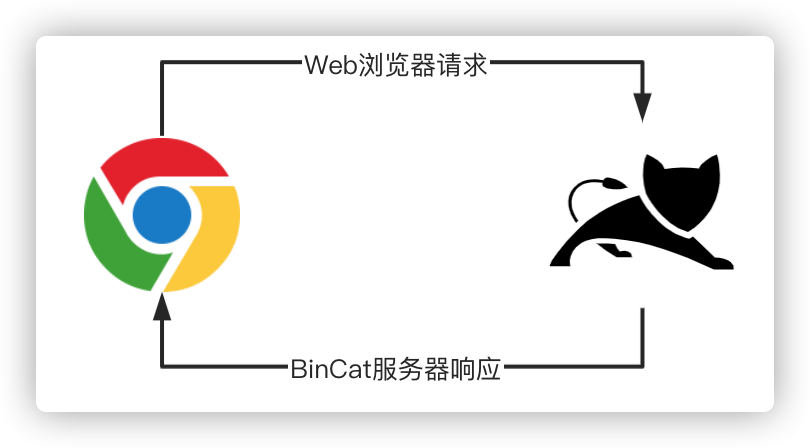
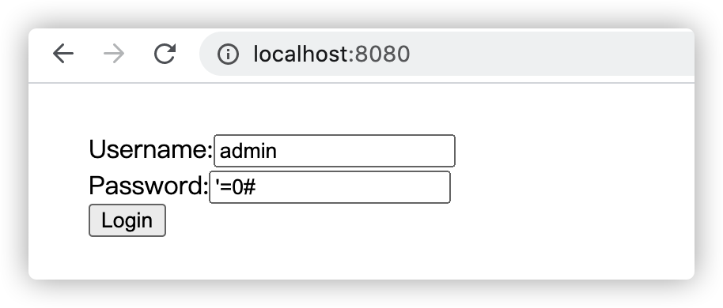
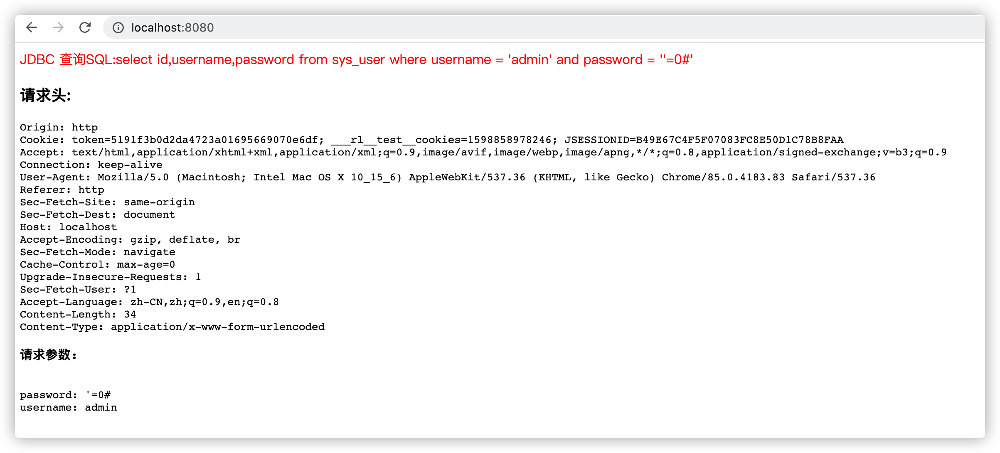

# BinCat

大家好，我是`BinCat`，一个基于`JavaEE API`实现的超简单(不安全的非标准的:sweat_smile:)的`Web Server`。


## Http请求协议解析

Http协议(`超文本传输协议，HyperText Transfer Protocol`)是一种用于分布式、协作式和超媒体信息系统的应用层协议。HTTP是万维网的数据通信的基础。要想能够处理Http请求就必须先解析Http请求，不同的Http请求方式对应的数据包也是不一样的。

**GET请求包示例：**

```
GET / HTTP/1.1
Host: localhost:8080
User-Agent: curl/7.64.1
Accept: */*

```

**POST请求包示例：**

```
POST /?s=java HTTP/1.1
Host: localhost:8080
User-Agent: curl/7.64.1
Accept: */*
Content-Length: 17
Content-Type: application/x-www-form-urlencoded

id=123&name=admin
```

解析POST请求的简单流程如下(`非multipart或chunked请求`)：

1. 解析第一行的Http协议信息。
2. 解析Http请求Header信息。
3. 解析请求主体(Body)部分。

接下来我们将以上述的POST包解析为例简单的实现Http协议解析。如上POST包，第一行数据中包含了请求方式、请求的URL地址以及Http协议版本信息(空格隔开)：`POST /?s=java HTTP/1.1`。那么我们只需要使用空白符号将字符串切割成数组即可完成解析。

**解析Http请求协议示例代码片段：**

```java
// 从Socket中读取一行数据，读取请求的URL
String str = dis.readLine();

// 切割请求Http协议信息
String[] strs = str.split("\\s+");

// 解析Http请求方法类型
String method = strs[0];

// 解析Http请求URL地址
String url = strs[1];

// 解析Http请求版本信息
String httpVersion = strs[2];
```

解析完Http请求协议后就应该继续解析Http Header信息了，Http请求头从第二行开始到一个空白行结束，Header中的键值对以`: `分割，如下：

```
Host: localhost:8080
User-Agent: curl/7.64.1
Accept: */*
Content-Length: 17
Content-Type: application/x-www-form-urlencoded
```

**解析Http头示例代码片段：**

```java
// 创建Header对象
Map<String, String> header = new ConcurrentHashMap<String, String>();

// 解析请求头信息
while (true) {
    // 按行读取Header头信息
    String line = dis.readLine();

    // 当读取到空行时停止解析Header
    if ("".equals(line)) {
      break;
    }

    // 切割Header的Key/Value
    String[] headers = line.split(":\\s*", -1);

    header.put(headers[0], headers[1]);
}
```

解析完Header后剩下的也就是最后的Http请求主体部分了，浏览器会将请求的参数以`&`为连接符拼接出多个参数，参数名称和参数值以`=`分割，并且参数值默认会使用URL编码，如下:

```
id=123&name=admin
```

解析body中的请求参数时需要先从Header中读取请求的主体大小，即:`Content-Length`，因为body中允许出现换行`\n`等特殊内容，所以解析body时应该按字节读取数据。除此之外，解析Body中的请求参数之前应该先解析URL中的请求参数，即GET传参部分：`/?s=java`，然后再解析body中的参数。

**解析Http GET参数代码片段：**

```java
// 初始化请求参数数组
Map<String, String> parameterMap = new ConcurrentHashMap<String, String>();

// 解析GET请求参数
if (url.contains("?")) {
    String parameterStr = url.split("\\?")[1];

    // 按"&"切割GET请求的参数
    String[] parameters = parameterStr.split("&");

    // 解析GET请求参数
    for (String parameter : parameters) {
      String[] tmp = parameter.split("=", -1);

      parameterMap.put(tmp[0], URLDecoder.decode(tmp[1]));
    }
}
```

**解析Http主体代码片段：**

```java
if ("POST".equalsIgnoreCase(method)) {
		String contentType = header.get("Content-Type");

		// 解析POST请求参数
		if ("application/x-www-form-urlencoded".equalsIgnoreCase(contentType)) {
			// 获取请求的主体长度
			int contentLength = Integer.parseInt(header.get("Content-Length"));

			// 创建一个和请求体一样大小的缓冲区
			byte[] bytes = new byte[contentLength];

			// 读取POST主体内容
			dis.read(bytes);

			// 解析POST请求内容
			String body = new String(bytes, "ISO8859-1");

			// 按"&"切割POST请求的参数
			String[] parameters = body.split("&");

			// 解析POST请求参数
			for (String parameter : parameters) {
				String[] tmp = parameter.split("=", -1);

				parameterMap.put(tmp[0], URLDecoder.decode(tmp[1]));
			}
	}
}
```


## BinCat v1-简单的请求文件访问处理

实现一个简单的Web服务器非常容易，使用`ServerSocket`在服务器端监听端口并等待浏览器请求，一旦接收到浏览器数据后就开始解析Http协议，最后将服务器端请求处理完后通过`Socket`返回给浏览器即可。



V1版本，我们先实现一个简单的读取服务器静态文件的功能，在后续版逐渐完善。

**BinCat v1示例:**

```java
package com.anbai.sec.server;

import java.io.*;
import java.net.ServerSocket;
import java.net.Socket;
import java.util.logging.Logger;

/**
 * ServerSocket示例
 */
public class BinCatServerV1 {

	private static final Logger LOG = Logger.getLogger("info");

	public static void main(String[] args) {
		try {
        // 设置服务监听端口
        int port = 8080;

        // 设置服务名称
        String serverName = "BinCat-0.0.1";

        // 创建ServerSocket，监听本地端口
        ServerSocket ss = new ServerSocket(port);

        LOG.info(serverName + "启动成功，监听端口:" + port);

        while (true) {
            try {
                // 等待客户端连接
                Socket socket = ss.accept();

                // 获取Socket输入流对象
                InputStream in = socket.getInputStream();

                // 获取Socket输出流对象
                OutputStream out = socket.getOutputStream();

                // 创建输出流对象
                BufferedReader br = new BufferedReader(new InputStreamReader(in));

                // 从Socket中读取一行数据
                String str = br.readLine();
              
              	if (str == null) {
                  	socket.close();
                  	continue;
                }

                // 切割请求Http协议信息
                String[] strs = str.split("\\s+");

                // 解析Http请求URL地址
                String url = strs[1];

                // 输出服务器返回信息
                String msg = "";

                // 当前服务器运行目录下的文件
                File file = new File(System.getProperty("user.dir"), url);

                if (file.exists()) {
                    out.write("HTTP/1.1 200 OK\n".getBytes());
                    msg = file.getAbsolutePath();
                } else {
                    out.write("HTTP/1.1 404 Not Found\n".getBytes());
                    msg = file.getAbsolutePath() + " Not Found!";
                }

                // 输出返回字节数
                out.write(("Content-Length: " + msg.getBytes().length + "\n").getBytes());

                // 写入换行
                out.write("\n".getBytes());

                // 将读取到的数据写入到客户端Socket
                out.write(msg.getBytes());

                in.close();
                out.close();
                socket.close();
            } catch (IOException e) {
              LOG.info("处理客户端请求异常:" + e);
            }
        }
		} catch (IOException e) {
			e.printStackTrace();
		}
	}

}
```

启动`BinCat`服务后控制台将输出:

```
九月 09, 2020 5:18:50 下午 com.anbai.sec.server.BinCatServerV1 main
信息: BinCat-0.0.1启动成功，监听端口:8080
```

浏览器请求[localhost:8080](http://localhost:8080)即可在浏览器中输出当前请求的文件是否存在:


请求一个不存在的文件地址，浏览器将会输出错误信息，如请求[localhost:8080/test](http://localhost:8080/test)：


从上图中我们可以看到响应的状态码和body都能够正确的被浏览器解析。


## BinCat v2-简单解析请求参数

V2版本我们需要支持请求参数解析以及简单的HTML页面渲染功能。

**BinCat v2示例:**

```java
package com.anbai.sec.server;

import java.io.*;
import java.net.ServerSocket;
import java.net.Socket;
import java.net.URLDecoder;
import java.util.Map;
import java.util.concurrent.ConcurrentHashMap;
import java.util.logging.Logger;

/**
 * ServerSocket Http 服务器示例
 */
public class BinCatServerV2 {

	private static final Logger LOG = Logger.getLogger("info");

	public static void main(String[] args) {
      try {
          // 设置服务监听端口
          int port = 8080;

          // 设置服务名称
          String serverName = "BinCat-0.0.2";

          // 创建ServerSocket，监听本地端口
          ServerSocket ss = new ServerSocket(port);

          LOG.info(serverName + "启动成功，监听端口:" + port);

          while (true) {
              try {
                // 等待客户端连接
                Socket socket = ss.accept();

                // 获取Socket输入流对象
                InputStream in = socket.getInputStream();

                // 获取Socket输出流对象
                OutputStream out = socket.getOutputStream();

                // 创建数据输出流对象
                DataInputStream dis = new DataInputStream(in);

                // 从Socket中读取一行数据，读取请求的URL
                String str = dis.readLine();

                if (str == null) {
                    socket.close();
                    continue;
                }

                // 切割请求Http协议信息
                String[] strs = str.split("\\s+");

                // 解析Http请求方法类型
                String method = strs[0];

                // 解析Http请求URL地址
                String url = strs[1];

                // 初始化Http请求URL地址
                String requestURL = url;

                // 初始化Http请求的QueryString
                String queryString;

                // 解析Http请求版本信息
                String httpVersion = strs[2];

                // 创建Header对象
                Map<String, String> header = new ConcurrentHashMap<String, String>();

                // 初始化请求参数数组
                Map<String, String> parameterMap = new ConcurrentHashMap<String, String>();

                // 解析GET请求参数
                if (url.contains("?")) {
                    String[] parameterStrs = url.split("\\?");
                    requestURL = parameterStrs[0];
                    queryString = parameterStrs[1];

                    // 按"&"切割GET请求的参数
                    String[] parameters = queryString.split("&");

                    // 解析GET请求参数
                    for (String parameter : parameters) {
                        String[] tmp = parameter.split("=", -1);

                        parameterMap.put(tmp[0], URLDecoder.decode(tmp[1]));
                    }
                }

                // 解析请求头信息
                while (true) {
                    // 按行读取Header头信息
                    String line = dis.readLine();

                    // 当读取到空行时停止解析Header
                    if ("".equals(line)) {
                      	break;
                    }

                    // 切割Header的Key/Value
                    String[] headers = line.split(":\\s*", -1);

                    header.put(headers[0], headers[1]);
                }

                // 输出服务器返回信息
                StringBuffer msg = new StringBuffer();

                // 处理Http请求,当浏览器请求主页时返回服务器信息
                if ("/".equals(requestURL)) {
                  out.write("HTTP/1.1 200 OK\n".getBytes());

                  // 根据Http请求类型处理不同的请求
                  if ("GET".equalsIgnoreCase(method)) {
                    // 输出服务器处理结果
                    msg.append("<html>\n" +
                        "<head>\n" +
                        "    <title>Login Test</title>\n" +
                        "</head>\n" +
                        "<body>\n" +
                        "<div style=\"margin: 30px;\">\n" +
                        "    <form action=\"/\" method=\"POST\">\n" +
                        "        Username:<input type=\"text\" name=\"username\" value=\"admin\"/><br/>\n" +
                        "        Password:<input type=\"text\" name=\"password\" value=\"'=0#\"/><br/>\n" +
                        "        <input type=\"submit\" value=\"Login\"/>\n" +
                        "    </form>\n" +
                        "</div>\n" +
                        "</body>\n" +
                        "</html>");
                  } else if ("POST".equalsIgnoreCase(method)) {
                    String contentType = header.get("Content-Type");

                    // 解析POST请求参数
                    if ("application/x-www-form-urlencoded".equalsIgnoreCase(contentType)) {
                      // 获取请求的主体长度
                      int contentLength = Integer.parseInt(header.get("Content-Length"));

                      // 创建一个和请求体一样大小的缓冲区
                      byte[] bytes = new byte[contentLength];

                      // 读取POST主体内容
                      dis.read(bytes);

                      // 解析POST请求内容
                      String body = new String(bytes, "ISO8859-1");

                      // 按"&"切割POST请求的参数
                      String[] parameters = body.split("&");

                      // 解析POST请求参数
                      for (String parameter : parameters) {
                          String[] tmp = parameter.split("=", -1);

                          parameterMap.put(tmp[0], URLDecoder.decode(tmp[1]));
                      }

                      // 定义SQL语句
                      String sql = "select id,username,password from sys_user where username = '" +
                          parameterMap.get("username") + "' and password = '" +
                          parameterMap.get("password") + "'";

                      msg.append("<font color='red'>JDBC 查询SQL:" + sql + "</font>\n");
                      msg.append("<h3>请求头:</h3>\n");
                      msg.append("<pre>\n");

                      for (String key : header.keySet()) {
                        	msg.append(key + ": " + header.get(key) + "\n");
                      }

                      msg.append("<pre>\n");
                      msg.append("<h3>请求参数:</h3>\n");

                      // 循环遍历请求参数
                      for (String key : parameterMap.keySet()) {
                        	msg.append(key + ": " + parameterMap.get(key) + "\n");
                      }
                    }
                  }
                } else {
                  out.write("HTTP/1.1 404 Not Found\n".getBytes());

                  // 输出错误信息
                  msg.append("404");
                }

                // 输出Web服务器信息
                out.write(("Server: " + serverName + "\n").getBytes());

                // 输出返回的消息类型
                out.write(("Content-Type: text/html; charset=UTF-8\n").getBytes());

                // 请求响应内容
                byte[] responseByte = msg.toString().getBytes();

                // 输出返回字节数
                out.write(("Content-Length: " + responseByte.length + "\n").getBytes());

                // 写入换行
                out.write("\n".getBytes());

                // 将读取到的数据写入到客户端Socket
                out.write(responseByte);

                in.close();
                out.close();
                socket.close();
              } catch (IOException e) {
                	LOG.info("处理客户端请求异常:" + e);
              }
          }
      } catch (IOException e) {
        	e.printStackTrace();
      }
	}

}
```

访问Web服务测试:



提交登陆表单测试：

